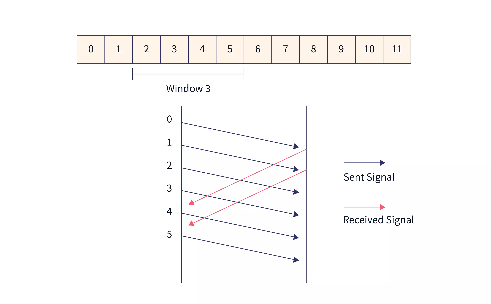
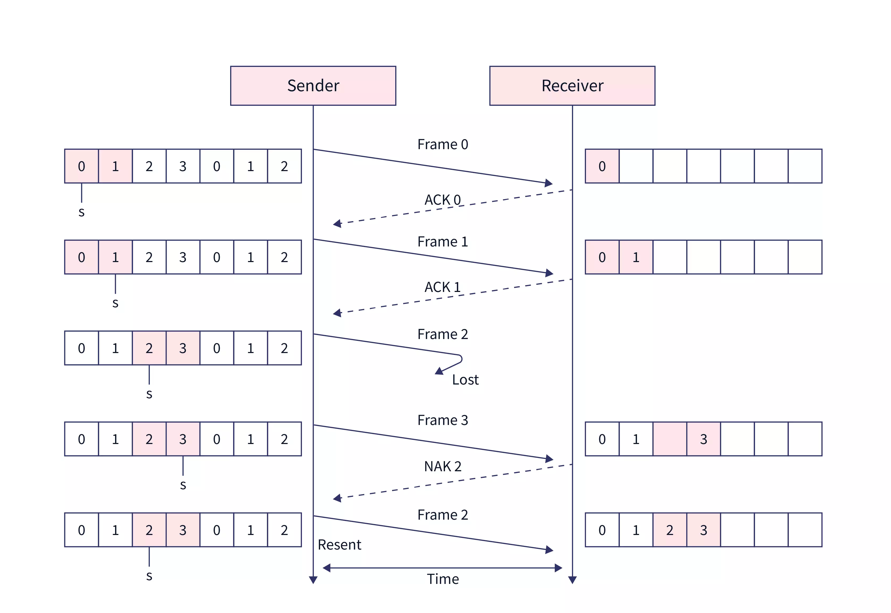
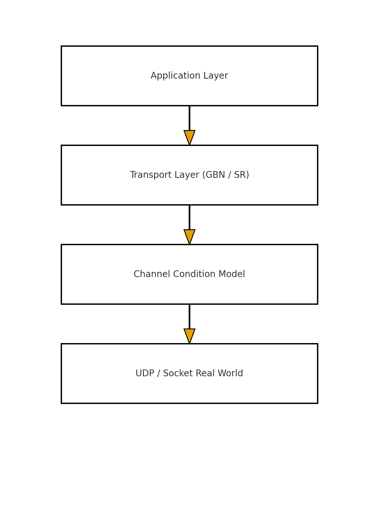

# 🍔 Byte-Bistro: A Tiny Restaurant Network Communication System for a Reliable UDP via GBN & SR Protocols

## 📘 Overview
An introductory to the foundation of **data communication** and **networking system** through a **low-level implementation** on a set of **transport protocols** over an **unreliable network**. Here, data are sent through `“orders”` over a **User Datagram Protocol (UDP)** and stirred in its `loss`/`dup`/`reorder`/`delay`, which then compared with a **Go-Back-N (GBN)** vs **Selective Repeat (SR)** end-to-end inclusion of its **replayable experiments**, **structured logs/CSVs**, and **visual plots**.

<p align="center">     </p>

## 📁 Project Layout
```graphql
Byte-Bistro/
├─ include/               # Public headers (bb_*.h)
├─ src/                   # Library + engines + mains
│  ├─ bb_channel.c        # Channel emulator (loss/dup/reorder/latency/rate)
│  ├─ bb_proto.c          # Shared proto scaffolding / factories
│  ├─ bb_gbn.c            # GBN implementation
│  ├─ bb_sr.c             # SR implementation (with per-packet timers/buffers)
│  ├─ bb_app.c            # App-level message format (ORDER / REPLY)
│  ├─ main_server.c       # Server entrypoint (GBN/SR selectable)
│  ├─ main_client.c       # Client entrypoint (CSV/LOG support)
│  ├─ shim_null_gbn.c     # Link shims (avoid duplicate factories)
│  ├─ shim_null_sr.c
│  └─ ... (bb_log, bb_timer, bb_wire, bb_checksum, etc.)
├─ tests/                 # Small unit tests for components
├─ scripts/               # Repro runs & plotting
│  ├─ server_gbn_baseline.sh   ┐
│  ├─ client_gbn_baseline.sh   │  # GBN baseline / impaired / uniform / exp
│  ├─ server_gbn_impaired.sh   │
│  ├─ client_gbn_impaired.sh   │
│  ├─ server_gbn_uniform.sh    │
│  ├─ client_gbn_uniform.sh    │
│  ├─ server_gbn_exp.sh        │
│  ├─ client_gbn_exp.sh        ┘
│  ├─ server_sr_baseline.sh    ┐
│  ├─ client_sr_baseline.sh    │  # SR baseline / impaired / uniform / exp
│  ├─ server_sr_impaired.sh    │
│  ├─ client_sr_impaired.sh    │
│  ├─ server_sr_uniform.sh     │
│  ├─ client_sr_uniform.sh     │
│  ├─ server_sr_exp.sh         │
│  ├─ client_sr_exp.sh         ┘
│  └─ plot_rtt.py              # 2×2 plots per scenario + boxplots
├─ logs/                  # Run artifacts (server_*.log, client_*.log)
├─ results/               # CSVs (client/server) and generated PNG plots
├─ Makefile               # Portable build (macOS/Linux), SSE4.2 when available
└─ orders.txt             # Example app payloads (ORDER lines)
```

## 🧠 Purpose and Motivation
Reliable data transport is often assumed to be `“solved”` by a **Transmission Control Protocol (TCP)**. However, several considerations such as the **internal complexity**, **kernel coupling**, and **adaptive heuristics** in modern TCP stacks creates an ambiguity for its experimentation. In addition, **Transport protocols** are simpler to understand by its **out-of-order**, **loss**, **dupes**, **rate limits** and **latency jitters**.

**Byte-Bistro** solves this issue by providing a sandbox where:
* Every **packet**, **ack**, **retransmission**, **timeout**, and **ordering event** is fully observable.
* Channel conditions are **mathematically controllable** (`loss`, `duplication`, `reordering`, `rate limits`, `jitter distributions`).
* Protocol behavior which can be **decomposed**, **modified**, and **extended** without operating the system interference.

Furthermore, the system wraps its implementation in a repeatable experiment harness where:
* **GBN**: simple sender protocol with a **sliding window** and **cumulative ACK** feature, whilst resending a whole suffix when its on loss, as shown below:

* **SR**: receiver buffers that are **out-of-order**, where the sender retransmits only its **timed-out packets**.


Paired with a controlled channel and a server `“cook”` time (processing latency), where it can isolated throguh its protocol behavior vs application latency in order to quantify the differences on the CSVs and visual plots. This is critical due to its protocol theory that must not stop at derivations, as it must be validated against its empirical runtime.

## ⚒️ Architecture Overview
Byte-Bistro is implemented and organized with strict modular responsibility separation as shown below:
| Module | Responsibility |
| --------------- | -------------------------------------------------------------------------------------------------------------------------------- |
| `bb_channel.c`  | Probabilistic channel model: inject loss, duplication, reordering, delay, jitter, bandwidth control, distribution-based cooking. |
| `bb_proto.c`    | Protocol factory dispatcher (select correct constructor based on mode).                                                          |
| `bb_gbn.c`      | Go-Back-N core implementation: cumulative acking, pipeline retransmission on loss, sender driven.                                |
| `bb_sr.c`       | Selective Repeat core implementation: per-seq buffering, independent retransmission, receiver side reassembly.                   |
| `bb_app.c`      | Application layer codec: encoding/decoding structured restaurant orders & structured replies.                                    |
| `main_server.c` | Server event loop: receives orders, parses application payloads, and generates order replies.                                    |
| `main_client.c` | Client driver: generates orders, measures RTT, logs CSV, and orchestrates execution loops.                                       |
| `bb_log.c`      | Minimal logging abstraction with semantic filtering (ERROR / WARN / INFO / DBG).                                                 |
| `bb_wire.c`     | Wire format framing for packet header encoding/decoding.                                                                         |
| `bb_timer.c`    | Portable monotonic RTO timers for retransmission scheduling.                                                                     |

Each layer is isolated and testable. No module leaks policy decisions into another layer to ensure a strict academic modularity. This architecture mirrors a well-designed research protocol stack as the following:



## ⚙️ Project Build
```bash
make clean && make
# Binaries:
#   byte-bistro-server-gbn, byte-bistro-client-gbn
#   byte-bistro-server-sr,  byte-bistro-client-sr
# Convenience symlinks:
#   byte-bistro-server -> *-gbn
#   byte-bistro-client -> *-gbn
```
> **Tested on**: macOS (Apple/Intel) & Ubuntu. Requires a POSIX shell and Python 3 for plotting.

## 🧩 Primary Executables
### Server (GBN/SR variants)
```css
./byte-bistro-server-gbn --port <p> --proto gbn [-v|-q]
    [--loss P] [--dup P] [--reorder P]
    [--dmean MS] [--djitter MS] [--rate Mbps] [--seed N]
    [--cook-min MS] [--cook-max MS]
    [--cook-dist uniform|exp] [--cook-mean MS]
    [--server-csv results/<file>.csv]     # if enabled in your build
```
### Client (GBN/SR variants)
```css
./byte-bistro-client-gbn --addr <ip:port> --proto gbn -c <clients> -n <orders> [-v|-q]
    [--rtt-csv results/<file>.csv]
    [--log logs/<file>.log]
```
> **Verbosity**: `-v` (debug), default (info), `-q` (warnings). <br>
>**Determinism**: fix the channel RNG via `--seed N`.

## 🛰 Channel Emulator (Server side)
The channel is injectable through the direct **pathologies** at the server with processes as shown below:
| Flag           | Meaning                       | Example        |
| -------------- | ----------------------------- | -------------- |
| `--loss P`     | Drop P% of packets            | `--loss 10`    |
| `--dup P`      | Duplicate P% of packets       | `--dup 5`      |
| `--reorder P`  | Reorder P% of packets         | `--reorder 10` |
| `--dmean MS`   | Mean one-way delay (ms)       | `--dmean 20`   |
| `--djitter MS` | ± jitter around mean (ms)     | `--djitter 10` |
| `--rate Mbps`  | Token-bucket rate-limit       | `--rate 50`    |
| `--seed N`     | RNG seed (deterministic runs) | `--seed 123`   |

### "Cook" Time (Application Latency) Knobs
| Flag                  | Meaning                       | Example               |
| --------------------- | ----------------------------- | --------------------- |
| `--cook-min MS`       | Min processing time           | `--cook-min 20`       |
| `--cook-max MS`       | Max processing time (uniform) | `--cook-max 200`      |
| `--cook-dist uniform` | Uniform between min and max   | `--cook-dist uniform` |
| `--cook-dist exp`     | Exponential distribution      | `--cook-dist exp`     |
| `--cook-mean MS`      | Mean for exponential          | `--cook-mean 40`      |

> If there is no specification for `--cook-*`, the server uses a fixed **40 ms** as its standardized default behavior.

## 🧪 Reproducible Scenarios
Each scenario has server & client scripts to be executed and run in **separate terminals** (recommended).
### GBN
```bash
# Terminal A
scripts/gbn_run/server/server_gbn_baseline.sh
# Terminal B
scripts/gbn_run/client/client_gbn_baseline.sh

scripts/gbn_run/server/server_gbn_impaired.sh   # adds loss/dup/reorder/delay/rate
scripts/gbn_run/client/client_gbn_impaired.sh

scripts/gbn_run/server/server_gbn_uniform.sh    # cook ~ Uniform[min,max]
scripts/gbn_run/client/client_gbn_uniform.sh

scripts/gbn_run/server/server_gbn_exp.sh        # cook ~ Exponential(mean)
scripts/gbn_run/client/client_gbn_exp.sh
```

### SR
```bash
# Terminal A
scripts/sr_run/server/server_sr_baseline.sh
# Terminal B
scripts/sr_run/client/client_sr_baseline.sh

scripts/sr_run/server/server_sr_impaired.sh
scripts/sr_run/client/client_sr_impaired.sh

scripts/sr_run/server/server_sr_uniform.sh
scripts/sr_run/client/client_sr_uniform.sh

scripts/sr_run/server/server_sr_exp.sh
scripts/sr_run/client/client_sr_exp.sh
```

Each **client** script writes:
* a **log** to `logs/<proto>_client_<scenario>.log`
* a **CSV** to `results/<proto>_client_<scenario>.csv` with header:
``` bash
ts_ms,proto,order_id,bytes_sent,bytes_recv,rtt_ms
```

Each **server** script writes:
* a **log** to `logs/<proto>_server_<scenario>.log`
* optionally a **CSV** to `results/<proto>_server_<scenario>.csv` with header:
``` bash
ts_ms,proto,served_id,items,cook_ms
```
If the build doesn’t have `--server-csv`, the logs can still parsed using `awk` (see below).

## 🧾 Capturing CSVs from Logs (fallback with awk)
If you skip `--rtt-csv` or want an alternative implementation, use the following:
``` bash
# From client logs → RTT CSV
awk '/ok id=/ {
  for (i=1;i<=NF;i++) {
    if ($i ~ /^id=/)  { sub("id=","",$i); id=$i }
    if ($i ~ /^rtt=/) { sub("rtt=","",$i); sub("ms","",$i); rtt=$i }
  }
  if (id != "" && rtt != "") { print id "," rtt }
}' logs/gbn_client_baseline.log > results/gbn_client_baseline.csv
```
> Repeat with the desired `*_client_*.log` or `*_server_*.log` and its corresponding filenames.

## 📈 Visual Plotting
### Appended 2×2 Based figures
Use Python 3 and matplotlib with the executables as shown below:
``` bash
# Baseline
python3 scripts/plot_rtt.py baseline

# Impaired channel
python3 scripts/plot_rtt.py impaired

# Uniform cook
python3 scripts/plot_rtt.py uniform

# Exponential cook
python3 scripts/plot_rtt.py exp
```
This generates:
* `results/rtt_2x2_<scenario>.png` — **four pannels** appeneded in one figure:
    * **Top-Left**: GBN — Client RTT (`order_id` vs `rtt_ms`)
    * **Top-Right**: GBN — Server Cook Time (`served_id` vs `cook_ms`)
    * **Bottom-Left**: SR — Client RTT
    * **Bottom-Right**: SR — Server Cook Time
* `results/rtt_box_<scenario>.png` — **optional boxplot** (client RTTs) <br>

The plotter tolerates both structurally **rich CSVs** (with headers shown above) and **minimal two-column** CSVs (`id,rtt`).

## 🧪 Sample Orders
The application layer is intentionally trivial. Example orders.txt:
``` scss
ORDER 1 double-cheese,cola
ORDER 2 fries,shake
ORDER 3 nuggets,water
ORDER 4 double-cheese,fries,cola
ORDER 5 salad,tea
```
The client alternates between a few items by default. In which, the app format is extendable via `bb_app.[ch]`.

## 🔍 Results Interpretability
* **Baseline**: RTTs cluster near **cook time** (+ network base delay). With cook=40 ms fixed, you’ll see ~40 ms RTT.
* **Impaired**: 
    * **GBN** shows **bursty RTT inflation** when a loss triggers **cascade retransmissions**.
    * **SR** often exhibits **smaller spikes** because it **retransmits missing packets only**.
* **Uniform cook**: server plot should show a flat spread between [min,max].
* **Exponential cook**: many short cooks with occasional long tails—great for testing tail latency behavior.


## 🧩 Design Notes (GBN vs SR)
* **Sequence space & windows**: both engines track `snd_una`/`snd_nxt` and `rcv_nxt`, with a bounded window.
* **GBN**:
    * Sender keeps a single RTO whilst on timeout, it **re-sends from snd_una**.
    * Receiver delivers **in order** only (drops out-of-order).
* **SR**:
    * Sender keeps **per-packet timers**; **only timed-out packets** are retransmitted.
    * Receiver buffers out-of-order and **delivers consecutively** when the gap closes.
* **Channel**:
    * Implements loss, duplication, reordering, one-way delay/jitter, and token-bucket rate limit.
    * Deterministic via `--seed`.

## 🧰 Troubleshooting
* **Client timeouts**: If both ends of the server and client side were run within a single terminal using a single script, the scheduling can starve and delay the server. Thus, an integration on **two terminals** is preferred with a single script per bash execution.
* **Port conflicts**: Scripts use distinct ports (e.g., 7777, 7778, 7779, 7780). If something is already bound, tweak the `PORT=...` at the top of the script.
* **CSV missing**: Ensure the `--rtt-csv` is passed on the client side (and `--server-csv` if the server build supports it). Otherwise, use the `awk` fallback.
* **Repeatability**: Always pass `--seed` on the server side when comparing runs.

## 🛣️ Future Work and Roadmaps
* **FEC (Forward Error Correction)** layer for burst losses.
* **Congestion Control** toy modules (AIMD, Reno-like).
* **Bi-directional data** (client → server → client flows).
* **Throughput & goodput reporting** alongside RTT.
* **pcap** capture hooks for Wireshark-friendly traces.
* **Property-based tests** (quickcheck-style) for channel and protocol invariants.
* **Threads** for multi-client load.
* **Protocol plug-in API** to allow custom transports.

## 👤 Author and Credentials
This project is fully established and contributed by the following author:
* **Name**: Rizky Johan Saputra
* **Institution**: Independent
* **Role**: Project Developer, Manager and Author
* **Education**: Undergraduate at Seoul National University (Enrolled at 2021, Graduating in 2026)
* **Project Scope**: Computer Networks, System Programming, Data Communication and Computer Architecture

## 📜 License
This repository is distributed under an Independent Personal License tailored by the author. See `LICENSE` for the full terms. For further inquiries and requests, please contact via GitHub or Email only.
> If you intend to reuse significant portions for research and academia purposes, please open and inquire an issue to discuss attribution and terms. 

## 🧷 Appendix
### Manual Baseline Run (GBN)
``` bash
# Terminal A
./byte-bistro-server-gbn --port 7777 --proto gbn -v --seed 123 \
  > logs/gbn_server_baseline.log 2>&1

# Terminal B
./byte-bistro-client-gbn --addr 127.0.0.1:7777 --proto gbn -c 1 -n 200 -v \
  --rtt-csv results/gbn_client_baseline.csv \
  > logs/gbn_client_baseline.log 2>&1
```
### Impaired Baseline Run (GBN)
``` bash
# Terminal A
./byte-bistro-server-sr --port 7779 --proto sr -v \
  --loss 10 --dup 5 --reorder 10 --dmean 20 --djitter 10 --rate 50 --seed 123 \
  > logs/sr_server_impaired.log 2>&1

# Terminal B
./byte-bistro-client-sr --addr 127.0.0.1:7779 --proto sr -c 1 -n 200 -v \
  --rtt-csv results/sr_client_impaired.csv \
  > logs/sr_client_impaired.log 2>&1
```
### Visual Plot Run (Python)
``` bash
python3 scripts/plot_rtt.py baseline
python3 scripts/plot_rtt.py impaired
python3 scripts/plot_rtt.py uniform
python3 scripts/plot_rtt.py exp
```
##
# <p align="center"><b>📲 Bon appétit and happy packet-cooking! 🍟</b></p>
